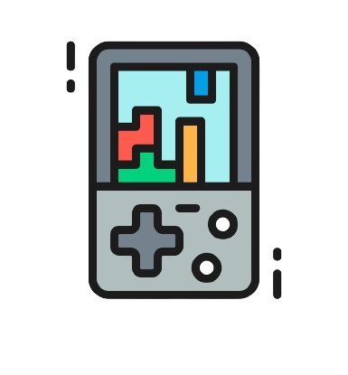

<p align="center">
    
</p>

<p align="center">
    
    
    
    
</p>

# nand2tetris

## Collection of projects for the nand2tetris course

The **nand2tetris** project is an educational initiative that guides participants through the process of building a complete computer system, starting from basic NAND gates and progressing to the development of a high-level programming language.

The project is divided into two main section: **Hardware Construction** and **Software Development**.

### *Hardware Construction*

1. **Elementary Logic Gates:** Implementation of elementary logic gates (AND, OR, NOT) using the NAND gate as the only primitive logic element.

2. **Arithmetic Logic Unit (ALU):** Design and implementation of an Arithmetic Logic Unit, a fundamental component for performing arithmetic and logic operations.

3. **Registers and Memory:** Construction of registers and memory components, leading to the creation of RAM units.

4. **CPU Design:** Development of the Central Processing Unit (CPU) by combining the ALU, registers, and control logic. The CPU is capable of executing simple instructions.

5. **Machine Language:** Introduction of an assembly-like machine language, with the creation of a simple machine language program to test the CPU.

### *Software Development*

1. **Assembler:** Design of an assembler that translates symbolic assembly language code into machine language instructions for the computer built in the Hardware Construction phase.

2. **Virtual Machine (VM):** Introduction of a stack-based virtual machine and development of a VM translator to convert programs written in a higher-level VM language into the machine language.

3. **High-Level Language:** Design and implementation of a high-level programming language called Jack. Development of a compiler to translate Jack programs into VM code.

4. **Operating System:** Construction of a simple operating system providing basic services to programs running on the computer.

## Explore around

For the **Hardware Construction** part you just have to use the tools (such as HardwareSimulator, CPUEmulator,...) provided by the project authors (`tools` folder) to interact with the components required at each step.
For what concerns the **Software Development** section there are always tool provided by the team but all the source code resides in the `code` folder and all the software for this project is written in Go.

```bash
  # To test some of your gates against the provided test suite
  ./tools HardwareSimulator ./Projects/01 - Logic Gates/01 - Not/Not.cmp
  # To run some of the software written in the second section
  cd code; go run cmd/hack_assembler/main.go     \
    ./Projects/06 - Assembler/01 - Add/Add.asm   \
    ./Projects/06 - Assembler/01 - Add/Add.hack  \
```

## Authors

- [@its-hmny](https://www.github.com/its-hmny) - Follow me on [Twitter](https://twitter.com/its_hmny) as well
- [nand2tetris project](https://www.nand2tetris.org/)
- [nand2tetris team](https://www.nand2tetris.org/copy-of-about)

## License

This project is distributed under the [GPLv3](https://choosealicense.com/licenses/gpl-3.0/) license.